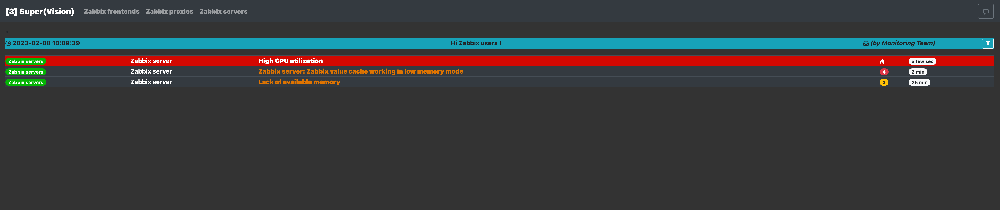

# Super-Vision :eyeglasses:
[](https://docs.outscale.com/en/userguide/Open-Source-Projects.html)

## Description
Super-Vision is a monitoring dashboard for Zabbix.

Tested for Zabbix 4.4.10 and 6.2



## Installation
You will need [Python 3.6+](https://www.python.org/) or later.
It is a good practice to create a dedicated virtualenv first. Even if it usually won't harm to install Python libraries directly on the system, better to contain dependencies in a virtual environment.

- Clone this repository
- Change directory
```
cd super-vision
```
- Create a virtualenv
```
python3 -m venv .venv
source .venv/bin/activate
```
- Install Python packages
```
pip3 install -r requirements.txt
```

## Usage
Fill the settings.py file with your informations about Zabbix server IP, severity ...

### TV Mode
You can use the TV Mode :tv: to remove the menu from the page by adding /tv/ in your URL.

_Example:_ http://127.0.0.1:8080/tv/

### MOTD

You can write a message which will be displayed for ALL host groups or only one with a different severity (Info, Warning, Disaster) by clicking on the button 
:speech_balloon:

### Multi Team
You can display multi host groups on the same page by adding a "+" between them.

_Example:_ http://127.0.0.1:8080/Zabbix%20proxies+Zabbix%20servers

## Contributing
- If you think you've found a bug in the code or you have a question regarding the usage of this software, please reach out to us by opening an issue in this GitHub repository.
- Contributions to this project are welcome: if you want to add a feature or a fix a bug, please do so by opening a Pull Request in this GitHub repository. In case of feature contribution, we kindly ask you to open an issue to discuss it beforehand.

## License
> Copyright Outscale SAS
>
> BSD-3-Clause
